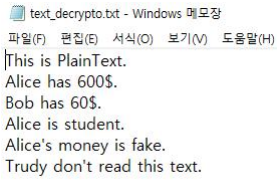
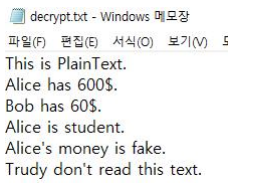

# 블록 암호화

*암호화 알고리즘 테스트 및 클라이언트 & 서버를 구축하여 암호화된 이미지, 텍스트를 주고 받고 인증 프로토콜의 과정을 수행한다*

### * 라이브러리

``C-Openssl 라이브러리``

## 1. Text 암호화

### 1) DES 암호화 & 복호화 결과

- 평문

- 암호문

- 복호문

### 2) 3-DES 암호문 & 복호문

- 평문은 DES와 동일하다.

- 암호문

- 복호문

### 3) AES 암호문 & 복호문

- 평문은 DES와 동일
- 암호문

- 복호문

### 4) 클라이언트(암호화) & 서버(복호화) 파일 전송

*DES, 3-DES, AES 3가지 모드 중 AES의 경우만 보여줌*

- Server

- 평문

- 암호문

- Client

- 암호문(전송받음)

- 복호문

## 2. 이미지(.bmp) 암호화

 

- 원본 이미지

- DES ECB 모드 암호화

- 3-DES ECB 모드 암호화

- AES ECB 모드 암호화

- DES CBC 모드 암호화

- 3-DES CBC모드 암호화

- AES CBC모드 암호화

