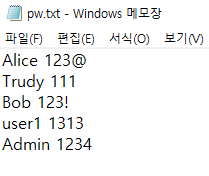
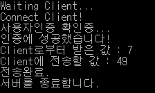
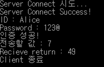
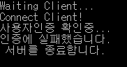
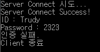
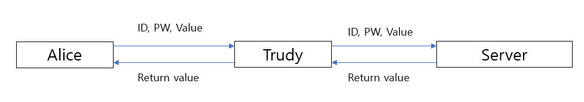

# 기본 방법(Password)

### 1) Password.txt

    

### 2) 인증성공

- Server

    

- Client

    

### 3) 인증 실패

- Server

    

- Client

    

### 4) 보안상 문제정 파악

- Trudy가 사용자의 정보를 획득할 수 있는 방법

  - 전수조사 
    - Trudy는 모든 경우의 수의 Password를 입력함으로써 사용자의 정보를 알아낼 수 있다.
  - 유사 패스워드 사전의 사용
    - 유사 패스워드 사전을 사용해서 사용자의 Password를 알아 낼 수 있다.

- Trudy가 어떤 값을 입력했는지 알 수 있는 방법

  - 중간자 공격과 단순 인증 재연 공격

        

    - 위와 같이 Trudy가 중간자 공격을 진행한다면 Alice와 서버는 Trudy가 정보를 보고 있는지도 알 수 없이 당하게 된다.

- 보안상의 문제점과 개선 사항

  - 보안상의 문제점
    - ID, PW가 중간에 Trudy에게 보이게 되면 그대로 노출이 된다.
    - 인증 과정이 단순하기 때문에 Server가 Alice를 특정할 수 없고, Alice 역시 Server를 특정할 수 없다.
  - 개선 사항
    - ID, PW의 암호화
    - 해시를 통한 전자서명으로 Alice와 Server가 서로를 특정할 수 있게 함.